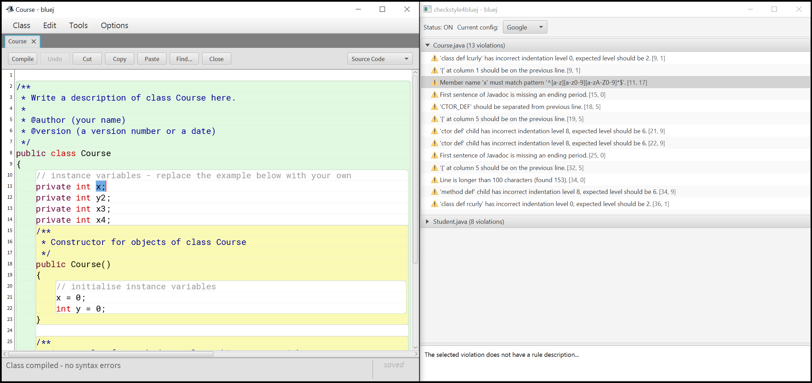
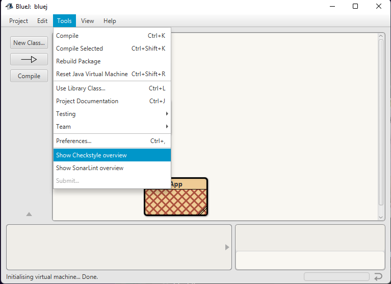
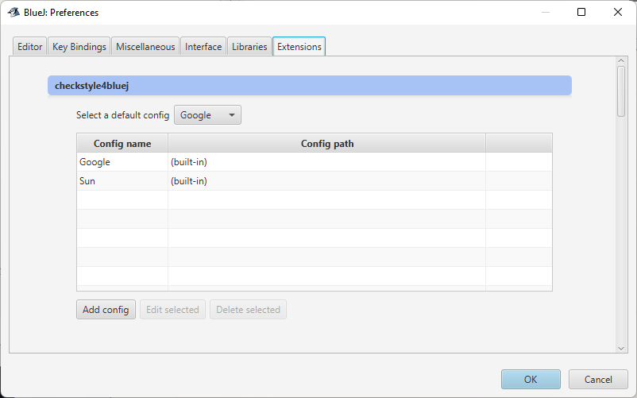
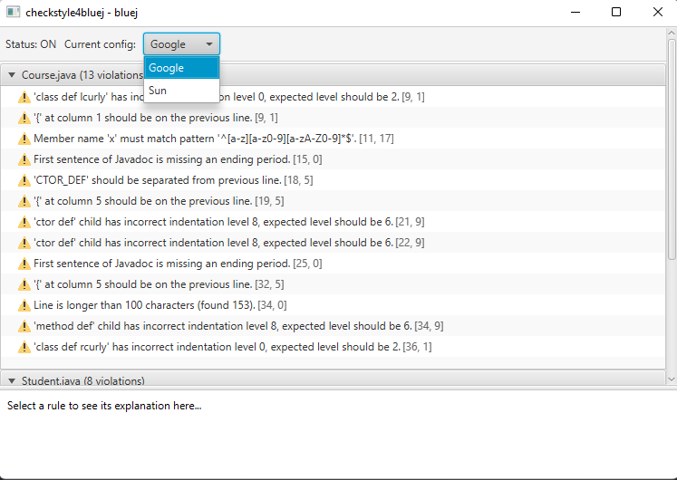

# BlueJ-Checkstyle-Plugin

checkstyle4bluej is a BlueJ plugin that allows you to use the Checkstyle source code analysis tool.
The user is provided the ability to choose what Checkstyle configuration file to use. 

**Note:** It is important that the configuration file is compatible with Checkstyle version 14.1.0.

## Installing the extension

1. Download the latest version of the extension found [here][1]
2. Move the downloaded JAR to a BlueJ extensions2 directory
3. Start BlueJ

  **BlueJ Extensions can be installed in three different directories:**
  - `User directory` installs for this user
  - `System directory` installs for all users of this system
  - `Project directory` installs for this project only
  
To install for a project, make a directory called `extensions2` in the projects root directory and move the JAR to that directory.

**In order to install for a user/system place the JAR in one of these directories:**

| Operating System | Install-type | Directories                                                  |
|------------------|--------------|--------------------------------------------------------------|
| **Mac**          | *User*       | `$HOME/Library/Preferences/org.bluej/extensions2`            |
|                  | *System*     | `<BLUEJ_HOME>/BlueJ.app/Contents/Resources/Java/extensions2` |
| **Unix**         | *User*       | `$HOME/.bluej/extensions2`                                   | 
|                  | *System*     | `<BLUEJ_HOME>/lib/extensions2`                               |
| **Windows**      | *User*       | `%USERNAME%\bluej\extensions2`                               | 
|                  | *System*     | `%PROGRAMFILES%\BlueJ\lib\extensions2`                       |

**Tip:** For Mac users, Control-click BlueJ.app and choose Show Package Contents to find the system directory.

For further information about Extensions in BlueJ see: [BlueJ Extensions][2]

## Usage

The Checkstyle Plugin runs checks in BlueJ when a Project/Package is opened and when a class file's state changes.
The plugin ignores files that have not been compiled.

You can view the violations discovered by choosing `Show Checkstyle overview` from the `Tools` menu. 

From the overview window you can double-click a violation to highlight the text in the BlueJ editor.

Which configuration file to use can be defined in the BlueJ preferences.

You can find the preferences by choosing `Preferences...` from the `Tools` menu and navigating to the `Extensions` tab.

The selected default config will be loaded by default, but can be changed from the dropdown menu in the overview window.

## Issues

Are you experiencing bugs/problems using this plugin? 

Submit a [bug report][3] with detailed reproduction steps.

We also appreciate ideas of enhancements and new features, feel free to suggest new features [here][4].

## Contributing

Contributions are welcome. Feel free to discuss the changes with us in a [feature request][4] before submitting a Pull Request.

## Dependencies

This plugin relies on the BlueJ Extensions2 API, which is included in BlueJ's own `bluej.jar`. That jar ships with every BlueJ
installation and is added to this repository's local Maven repository in the `lib` directory as `bluej:bluej`.
Detailed information about the API can be found in the [BlueJ documentation][5].

The current version is taken from BlueJ 6.0.0 (Java 21, Extensions2 API major version 3).

Toolscripts are available to install the jar from a newer BlueJ version into the `lib` directory. Both take the BlueJ version as an argument:

- **Windows:** [`tools/updateBlueJdeps.ps1`](tools/updateBlueJdeps.ps1) (assumes BlueJ is installed for all users, in `C:\Program Files\BlueJ`)
- **macOS:** [`tools/updateBlueJdeps.sh`](tools/updateBlueJdeps.sh), e.g. `./tools/updateBlueJdeps.sh 6.0.0`. It looks for `BlueJ.app` in
  `/Applications` or `~/Applications`, or you can pass the directory containing `bluej.jar` as a second argument.

After installing a new version, update the `bluej:bluej` dependency version in `pom.xml` to match.

A lot of core functionality for this plugin is provided by [BlueJ-Linting-Core][6], feel free to take a look at it as well.

[1]: https://github.com/NTNU-IE-IIR/BlueJ-Checkstyle-Plugin/releases/latest
[2]: https://www.bluej.org/extensions/extensions2.html
[3]: https://github.com/NTNU-IE-IIR/BlueJ-Checkstyle-Plugin/issues/new?assignees=&labels=&template=bug_report.md&title=
[4]: https://github.com/NTNU-IE-IIR/BlueJ-Checkstyle-Plugin/issues/new?assignees=&labels=&template=feature_request.md&title=
[5]: https://www.bluej.org/extensions/writingextensions2.html
[6]: https://github.com/NTNU-IE-IIR/BlueJ-Linting-Core/