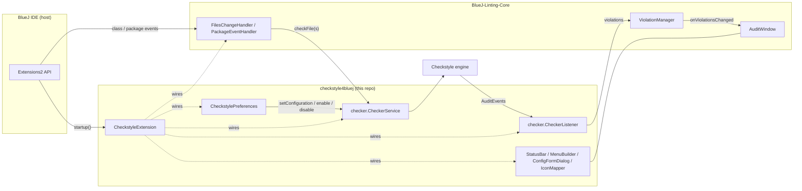
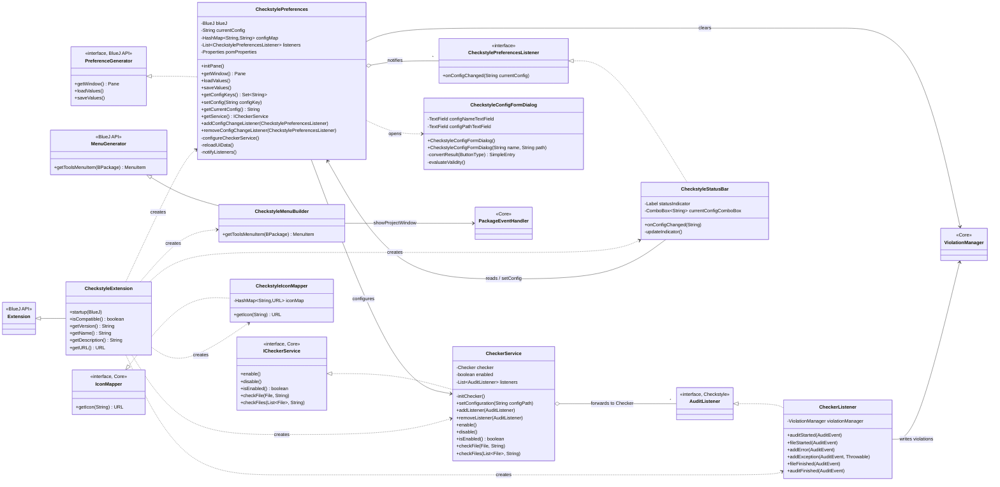
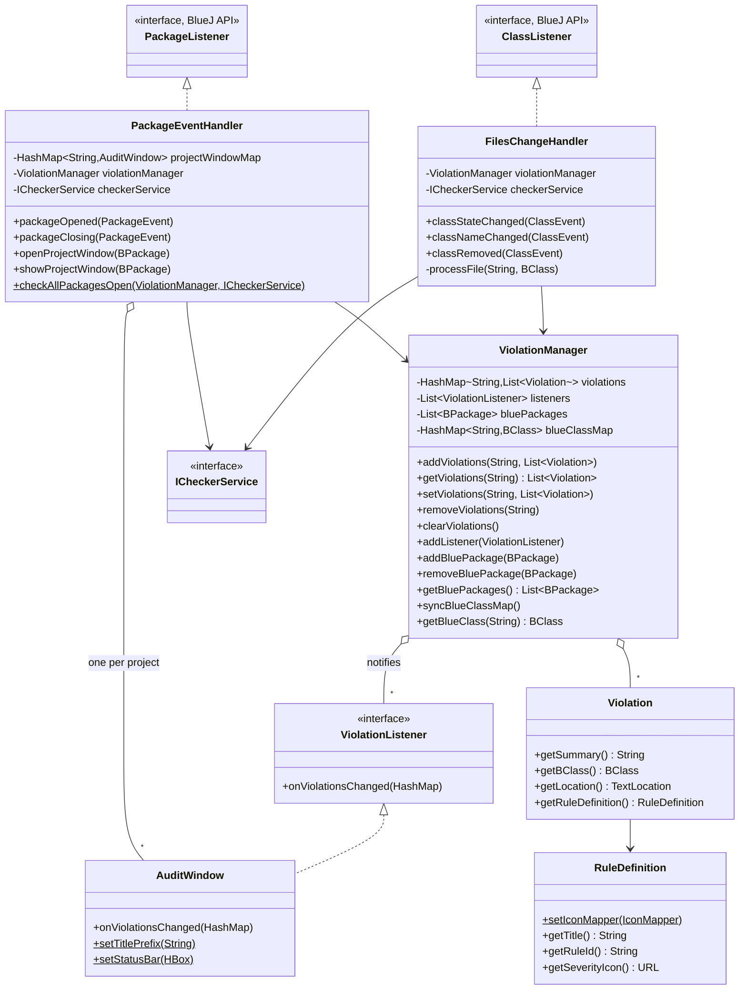
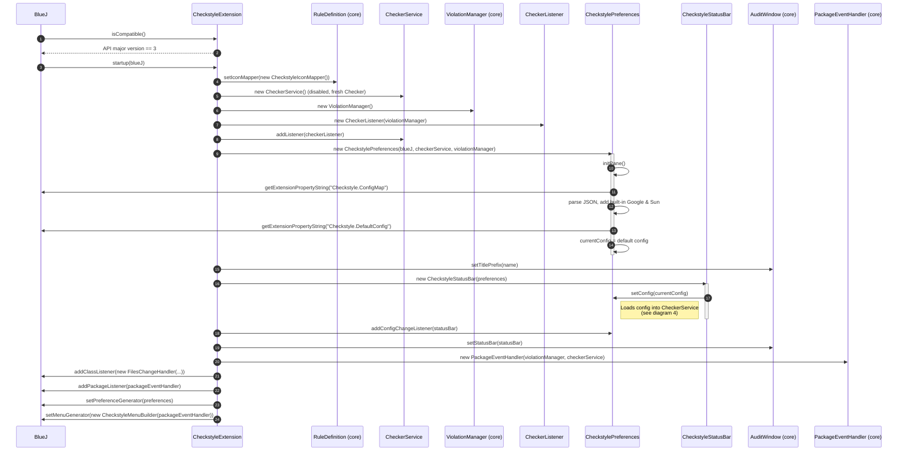
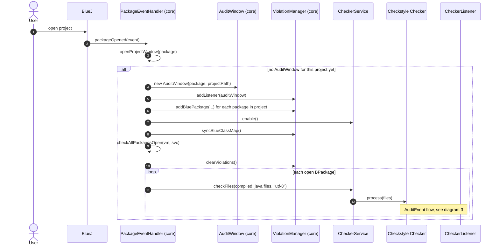
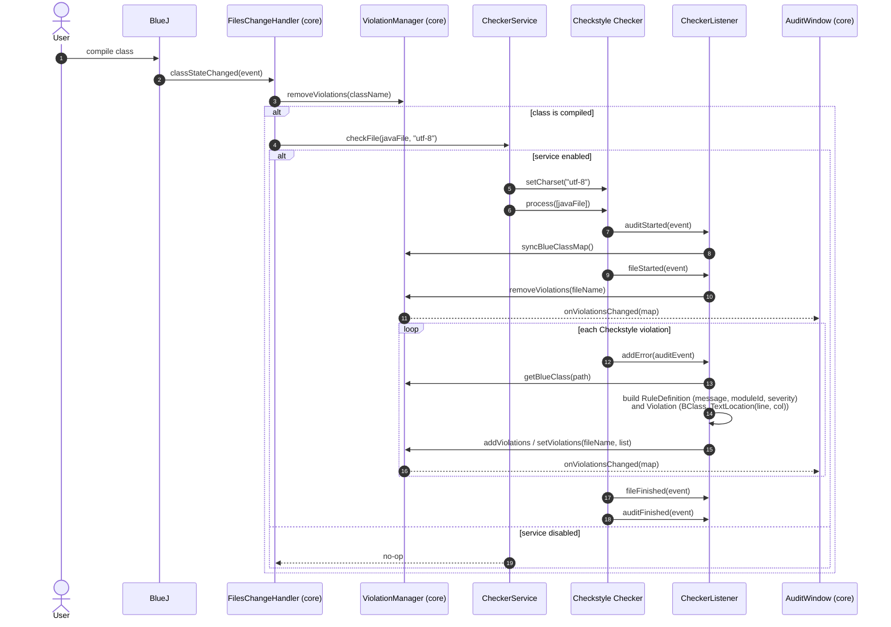
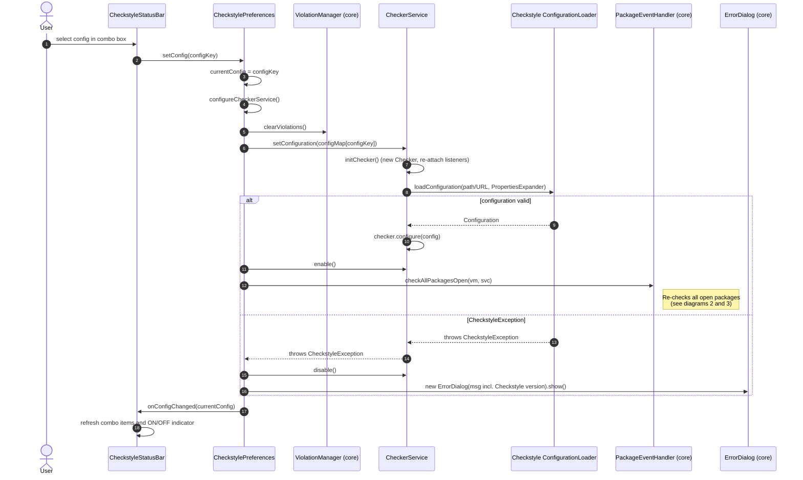
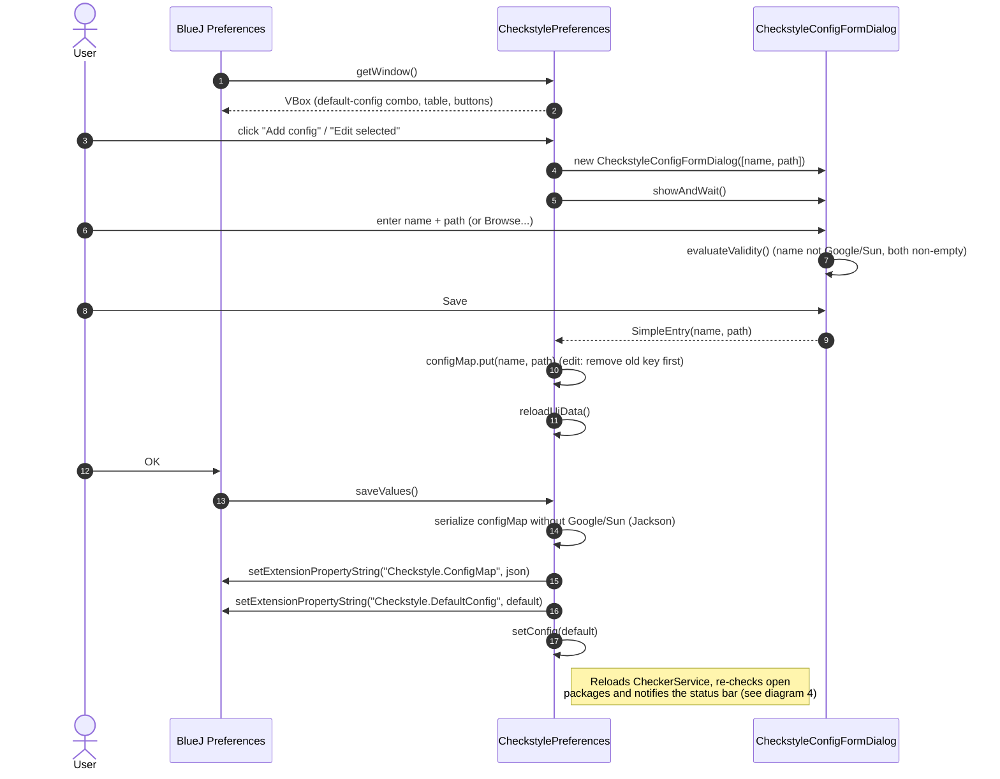
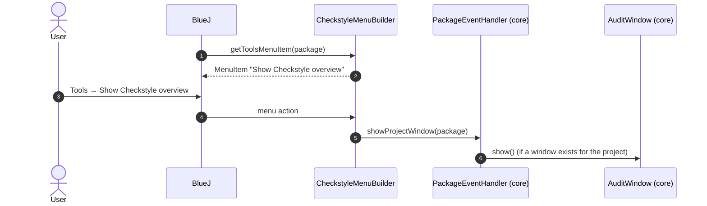

# Architecture

This document describes the architecture of **checkstyle4bluej**, a [BlueJ](https://www.bluej.org/)
extension that runs [Checkstyle](https://checkstyle.org/) against the code in open BlueJ projects and
shows the violations in an audit window.

## Overview

The extension is a thin, Checkstyle-specific layer on top of two external pieces:

| Layer | Provided by | Responsibility |
|---|---|---|
| Host IDE | **BlueJ Extensions2 API** (`bluej.extensions2.*`, `provided` scope) | Extension lifecycle, class/package events, Preferences and Tools-menu hooks, extension property storage |
| Generic linting framework | **BlueJ-Linting-Core** (`no.ntnu.iir.bluej.extensions.linting.core.*`, via JitPack) | Event handlers, violation store, audit window UI, error dialog, `ICheckerService` / `IconMapper` contracts |
| Checkstyle plugin (this repo) | `no.ntnu.iir.bluej.extensions.linting.checkstyle.*` | Running Checkstyle, translating its audit events into core `Violation`s, managing Checkstyle config files and preferences UI |
| Linter engine | **Checkstyle** (`com.puppycrawl.tools.checkstyle.*`, version pinned in `pom.xml`) | Parsing configuration and checking Java source files |



The key design idea is **inversion through the core library**: the core library owns *when* files are
checked (reacting to BlueJ events) and *how* results are displayed, while this repo only supplies
*what* checks a file (`CheckerService`, an `ICheckerService`) and *how* results are translated
(`CheckerListener`).

## Package structure

```
no.ntnu.iir.bluej.extensions.linting.checkstyle
├── CheckstyleExtension            BlueJ entry point; wires everything together
├── CheckstylePreferences          Preferences pane + config persistence + config switching
├── CheckstylePreferencesListener  Observer interface for config changes
├── CheckstyleConfigFormDialog     Modal add/edit dialog for one (name, path) config entry
├── CheckstyleStatusBar            ON/OFF indicator + config picker shown in the AuditWindow
├── CheckstyleMenuBuilder          Tools-menu item "Show Checkstyle overview"
├── CheckstyleIconMapper           Severity name -> icon URL
├── ProvidedConfigs                Finds configs shipped in extensions2/checkstyle4bluej/
├── SystemInfo                     Build info (version), generated from src/main/java-templates/
└── checker
    ├── CheckerService             Owns and configures the Checkstyle Checker
    └── CheckerListener            Checkstyle AuditListener -> core Violations
```

Resources (`src/main/resources`):

- `config/google_checks.xml`, `config/sun_checks.xml` – the two built-in configurations ("Google" and
  "Sun"), always present and not editable/deletable from the UI.
- `config/pom.properties` – filtered at build time; used to report the Checkstyle version in error
  messages.
- `images/warning.png`, `images/error.png` – severity icons.
- `styles/text-input.css` – error styling for the config form dialog.

## Class diagrams

### Plugin classes and their collaborators



### BlueJ-Linting-Core classes used by the plugin

These classes live in the external core library but are central to understanding the runtime
behaviour.



## Key design decisions

- **Single shared state.** `CheckstyleExtension.startup()` creates exactly one `CheckerService`, one
  `ViolationManager` and one `CheckstylePreferences`; every other component receives them through its
  constructor (manual dependency injection). There is no static service locator apart from the static
  setters the core library exposes (`RuleDefinition.setIconMapper`, `AuditWindow.setTitlePrefix`,
  `AuditWindow.setStatusBar`).
- **Observer pattern, twice.**
  - Checkstyle → plugin: `CheckerListener` is registered as a Checkstyle `AuditListener` on the
    `Checker` and receives audit events while files are processed.
  - Preferences → UI: `CheckstylePreferences` notifies `CheckstylePreferencesListener`s (currently
    only `CheckstyleStatusBar`) whenever the active configuration or saved preferences change.
  - (In the core library, `ViolationManager` likewise notifies `ViolationListener`s, i.e. the
    `AuditWindow`s.)
- **Fresh `Checker` per configuration.** `CheckerService.setConfiguration()` calls `initChecker()` to
  build a brand-new Checkstyle `Checker` before configuring it, so modules from a previous
  configuration can never linger. Because of that, `CheckerService` keeps its own list of
  `AuditListener`s and re-attaches them to every new `Checker`.
- **Enable/disable gate.** `checkFile`/`checkFiles` are no-ops while the service is disabled. The
  service is disabled at construction and whenever a configuration fails to load, so an invalid
  config never produces partial or misleading results.
- **Violations keyed by file name.** `CheckerListener.fileStarted()` removes all existing violations
  for a file before Checkstyle reports new ones, so re-checking a file always replaces (never
  appends to) its previous results.
- **Persistence through BlueJ.** User-defined configs are stored as a JSON map (Jackson) in BlueJ's
  extension properties under `Checkstyle.ConfigMap`; the default config name under
  `Checkstyle.DefaultConfig`. The built-in Google/Sun entries are stripped before saving and
  re-injected (as classpath resource URLs) on load.

## Sequence diagrams

### 1. Extension startup

BlueJ loads the extension jar and calls `startup()`, which builds and wires the object graph.



### 2. Opening a project – initial check of all files

When a project is opened, the core library creates an `AuditWindow` for it and checks every compiled
class in all open packages.



### 3. Re-checking a file after it is compiled

This is the most frequent action: the user edits and compiles a class, and its violations are
refreshed.



`classRemoved` only removes the class's violations; `classNameChanged` removes violations under the
old name and re-checks the class.

### 4. Switching the active Checkstyle configuration

The user picks a different configuration in the status bar of the `AuditWindow`. The same
`setConfig()` path is also used once during startup.



### 5. Managing configurations in Preferences

Adding, editing or deleting a configuration in **Tools → Preferences → Extensions**, followed by
pressing OK.



After the settings are saved, `saveValues()` makes the selected default config the active one and
reconfigures the `CheckerService`. Changes such as a new default or an edited path for the active
config take effect immediately, without restarting BlueJ.

### 6. Showing the overview window from the Tools menu



## Build and packaging

- Maven project, Java 21 (`maven.compiler.release`), targeting the BlueJ Extensions2 API major
  version 3 (BlueJ 6.0.0).
- `maven-shade-plugin` produces the installable fat jar `target/checkstyle4bluej-<version>.jar`
  containing Checkstyle, Jackson and BlueJ-Linting-Core. JavaFX and BlueJ's own `bluej.jar` are
  `provided` by BlueJ at runtime and are not bundled.
- `bluej:bluej` (BlueJ 6's `bluej.jar`, which contains the Extensions2 API) is resolved from the
  file-based Maven repository in `lib/`; BlueJ-Linting-Core from JitPack
  (`com.github.NTNU-IE-IIR:BlueJ-Linting-Core`).
- Releases are produced by one GitHub Actions workflow (`.github/workflows/release.yml`), run from
  `develop`; it also fast-forwards `main` to the release tag.
